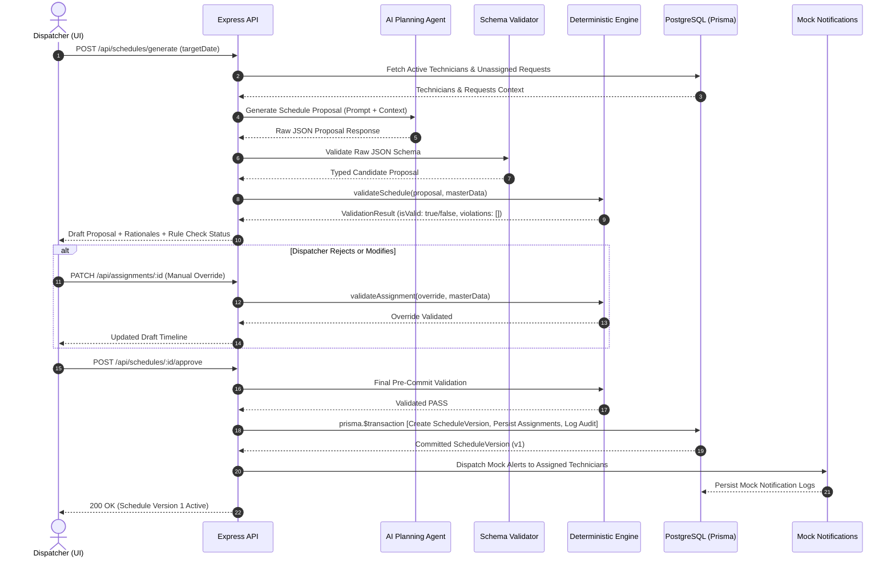

# 04 — System Architecture: Field Service Dispatch & Replanning

## 1. High-Level Architectural Architecture

The Field Service Dispatch & Replanning system is built upon a unidirectional, verified control loop designed to enforce safety, reliability, and human supervision over probabilistic AI intelligence.

```
                      +---------------------------------------+
                      |         FIELD SERVICE DISPATCHER      |
                      +---------------------------------------+
                                          │
                                 1. Request / Trigger
                                          ▼
                      +---------------------------------------+
                      |           FRONTEND CLIENT             |
                      |    (React, Timeline, Diff Viewer)     |
                      +---------------------------------------+
                                          │
                                 2. REST API Request
                                          ▼
                      +---------------------------------------+
                      |             BACKEND API               |
                      |   (Controllers, Services, Auth/Ctx)   |
                      +---------------------------------------+
                                          │
                        3. Prompt Context │
                                          ▼
                      +---------------------------------------+
                      |           AI PLANNING AGENT           |
                      |  (Gemini Free API / Local Heuristic)  |
                      +---------------------------------------+
                                          │
                                 4. Structured Proposal (JSON)
                                          ▼
                      +---------------------------------------+
                      |        SCHEMA VALIDATION LAYER        |
                      |         (Zod Runtime Parser)          |
                      +---------------------------------------+
                                          │
                                 5. Syntactically Valid AST
                                          ▼
                      +---------------------------------------+
                      |    DETERMINISTIC CONSTRAINT ENGINE    |
                      |  (Pure TypeScript 7-Rule Validator)   |
                      +---------------------------------------+
                                          │
                         6. Verification Result + Error Matrix
                                          ▼
                      +---------------------------------------+
                      |       DISPATCHER REVIEW STAGE         |
                      |  (Visual Inspection, Manual Edits)    |
                      +---------------------------------------+
                                          │
                                 7. Dispatcher Approval
                                          ▼
                      +---------------------------------------+
                      |      SCHEDULE VERSIONING & AUDIT      |
                      |  (ACID Transaction, Immutable Bump)   |
                      +---------------------------------------+
                                          │
                         8. Persist       │ 9. Emit Mock Event
                                          ▼
+--------------------------------------+      +--------------------------------------+
|            DATABASE LAYER            |      |       MOCK NOTIFICATION SERVICE      |
|    (PostgreSQL / Prisma Engine)      |      |   (In-App Worker & Technician Alert) |
+--------------------------------------+      +--------------------------------------+
```

---

## 2. Core Architectural Principle: Guarded Autonomy

> **"AI proposes. Deterministic code validates. Human approves."**

### Why AI Must Never Bypass Deterministic Validation
1. **Mathematical Invariant Guarantees**: LLMs are statistical sequence generators. Even with advanced prompting or temperature 0, an LLM can hallucinate an impossible assignment (e.g. an 80-minute task crammed into a 45-minute window, a technician scheduled in two places simultaneously, or assigning a plumbing leak to an electrician).
2. **Completed Task Protection**: When an intraday emergency arrives, automated agents often attempt to re-optimize from clean slate, moving tasks that a technician already completed hours ago. Deterministic validation strictly enforces `validateCompletedAssignment()` as an unbreachable lock.
3. **Legal & Compliance Defense**: In field operations, OSHA work-hour limits, union shift rules, and customer SLAs carry legal and financial penalties. Pure deterministic code provides 100% reproducible audit guarantees.
4. **Database Safety**: The AI layer has **read-only** context access. It possesses zero credentials to mutate database tables directly.

---

## 3. Subsystem Breakdown & Module Boundaries

### 3.1 Frontend Architecture (`client/src/`)
* **`components/timeline/`**: Custom Gantt-style daily timeline grid (08:00–17:00 in 30-min columns) mapping technicians on rows and assignment blocks on time slots.
* **`components/proposals/`**: AI reasoning drawer displaying trade-offs, confidence levels, unassigned request explanations, and clarification questions.
* **`components/diff/`**: Side-by-side schedule version diff viewer color-coding assignments (`UNCHANGED`, `RESCHEDULED`, `REASSIGNED`, `NEW`, `UNASSIGNED`).
* **`components/overrides/`**: Drag-and-drop or modal editor allowing manual dispatcher reassignment with instant local validation feedback.
* **`hooks/`**: TanStack Query wrappers (`useSchedule`, `useTechnicians`, `useServiceRequests`, `useAuditLogs`).

### 3.2 Backend API Layer (`server/src/api/`)
* **Controllers**: Thin HTTP boundary handlers parsing query parameters, validating payloads using Zod schemas, and dispatching to services.
* **Middleware**: Error handling, request ID tagging, and audit log interceptors.
* **Routes**:
  * `/api/requests`: Service request lifecycle management.
  * `/api/technicians`: Technician availability, region, and skills management.
  * `/api/schedules`: Generation, proposal diffing, approval, and version retrieval.
  * `/api/assignments`: Individual assignment validation and manual modification.
  * `/api/audit-logs`: Querying immutable change logs.

### 3.3 AI Agent Layer (`server/src/ai/`)
* **Prompt Engine**: Compiles system instructions, operational constraints, available technician roster, and pending service requests into a structured prompt.
* **Provider Adapter**:
  * `GeminiProvider`: Communicates with Google Gemini API (`gemini-1.5-flash` / `gemini-2.0-flash`) using free API keys from Google AI Studio and native structured JSON schema.
  * `MockAIProvider`: Standalone deterministic greedy heuristic solver running 100% locally with zero external API keys, zero network requests, and zero tokens.
* **Reasoning Parser**: Ingests raw model JSON, passes it through Zod schemas, and maps trade-offs, risk ratings, and questions into strongly-typed DTOs.

### 3.4 Deterministic Scheduling Engine (`server/src/engine/`)
* **Isolated Pure Module**: Zero database imports, zero network requests. Accepts typed input data and returns an immutable verification object.
* **Rule Modules**:
  1. `SkillRule`: `technician.skills.includes(request.requiredSkill)`
  2. `RegionRule`: `technician.region === request.region`
  3. `AvailabilityRule`: `start >= tech.shiftStart && end <= tech.shiftEnd`
  4. `TimeWindowRule`: `start >= request.windowStart && end <= request.windowEnd`
  5. `NoOverlapRule`: For all assignments $i \ne j$, $\max(0, \min(end_i, end_j) - \max(start_i, start_j)) = 0$
  6. `MaxWorkloadRule`: $\sum \text{duration}_i \le \text{technician.maxWorkloadMinutes}$
  7. `CompletedLockRule`: An assignment with status `COMPLETED` or `IN_PROGRESS` cannot have its `technicianId`, `startTime`, or `duration` altered.

### 3.5 Approval & Versioning Service (`server/src/services/schedule.service.ts`)
* **State Transition Control**: Manages proposal lifecycle (`DRAFT` -> `VALIDATED` -> `APPROVED` | `REJECTED`).
* **ACID Versioning**: When approved, wraps the creation of `ScheduleVersion`, cloned `Assignment` records, and status update in a Prisma `$transaction`.
* **Disruption Preemption**: Orchestrates emergency insertions and technician cancellations, preserving locked assignments.

### 3.6 Audit & Notification Service (`server/src/services/audit.service.ts`)
* **Audit Logger**: Appends immutable records with timestamp, actor (`DISPATCHER` or `AI_AGENT`), action type, version reference, and payload diff.
* **Mock Notification Dispatcher**: Simulates push/SMS notifications dispatched to affected technicians when a new schedule version is activated.

---

## 4. End-to-End Execution Sequence Diagram



---

## 5. Security, Isolation & Safety Boundaries

1. **AI Sandbox**: The AI module has no ORM models or database client in scope. It receives read-only JSON snapshots and emits candidate JSON.
2. **Tamper-Proof Audit History**: `ScheduleVersion` and `AuditLog` tables have no `UPDATE` or `DELETE` API endpoints exposed. They are append-only.
3. **Zero Untrusted Execution**: All AI-suggested times, technician IDs, and request IDs are checked against database primary keys to eliminate hallucinated entity references.
